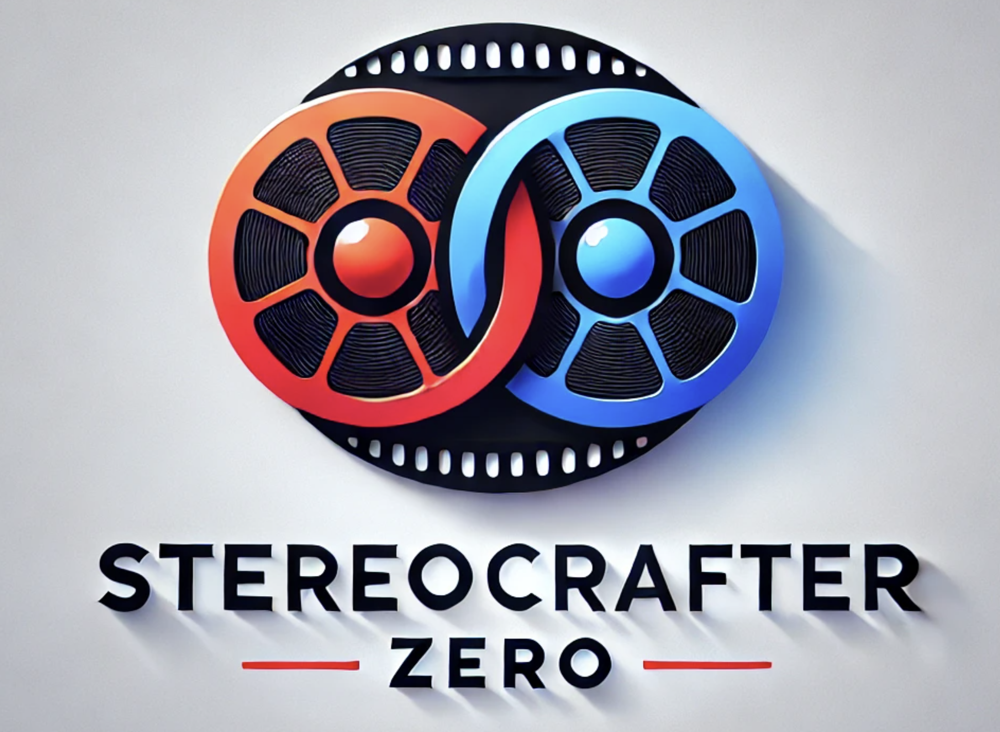
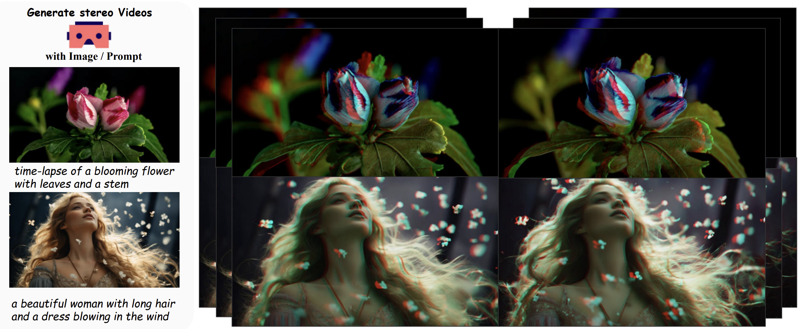

</img>
<h1 style="margin-top:40px;">StereoCrafter-Zero: Zero-Shot Stereo Video Generation with Noisy Restart</h1>

  

</img>

 
## 🔆 Introduction
🔥🔥 Our method performs stereo video generation with only a single image and a prompt as input. We show anaglyph for best showing the stereoscopic effects.
 

### 1.1. Showcases (576x1024)
<table class="center">
  <!-- <tr>
    <td colspan="1">"fireworks display"</td>
    <td colspan="1">"a robot is walking through a destroyed city"</td>
  </tr> -->
  <tr>
  <td>
    
  </td>
  <td>
    
  </td>
  </tr>
  <tr>
  <td>
    
  </td>
  <td>
    
  </td>
  </tr>
  <tr>
  <td>
    
  </td>
  <td>
    
  </td>
  </tr>
</table>

### 1.2. Showcases (320x512)
<table class="center">
  <tr>
  <td>
    
  </td>
  <td>
    
  </td>
  </tr>

  <tr>
  <td>
    
  </td>
  <td>
    
  </td>
  </tr>

  <tr>
  <td>
    
  </td>
  <td>
    
  </td>
  </tr>
</table>

### 1.3. Showcases (256x256)

<table class="center">
  <tr>
  <td>
    
  </td>
  <td>
    
  </td>
  </tr>

  <tr>
  <td>
    
  </td>
  <td>
    
  </td>
  </tr>
</table>

### 2. Applications

#### 2.2 Generative frame interpolation

<table class="center">
    <tr style="font-weight: bolder;text-align:center;">
        <td>Input starting frame</td>
        <td>Input ending frame</td>
        <td>Generated stereo video</td>
    </tr>
   <tr>
  <td>
    
  </td>
  <td>
    
  </td>
  <td>
    

      
      
    

  </td>
  </tr>
  <tr>
  <td>
    
  </td>
  <td>
    
  </td>
  <td>
    

      
      
    

  </td>
  </tr> 
</table >

#### 2.3 Looping video generation
<table class="center">

  <tr>
  <td>
    
  </td>
  <td>
    
  </td>
  </tr>

  <tr>
  <td>
    
  </td>
  <td>
    
  </td>
  </tr>

</table >
